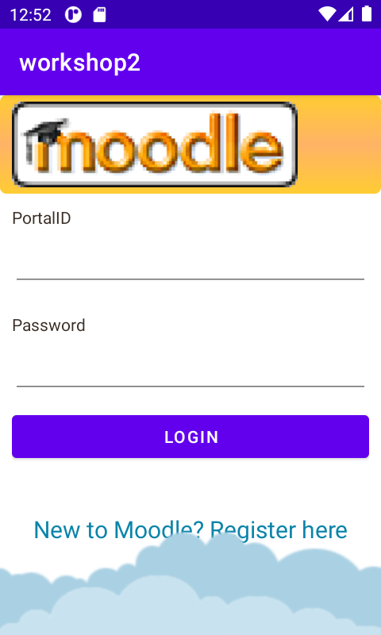

# Android Workshop

A simple Android application to display HKU courses and corresponding teachers.

- `Workshop Materials/` folder contains all steps to create this application.
- `Screenshot/`folder contains a login image and a course list image.

The code style of this project is not good. It just shows us how to write an Android application with Android Studio. In the later development we should be more concerned about the project architecture like MVP, MVC and so on.
